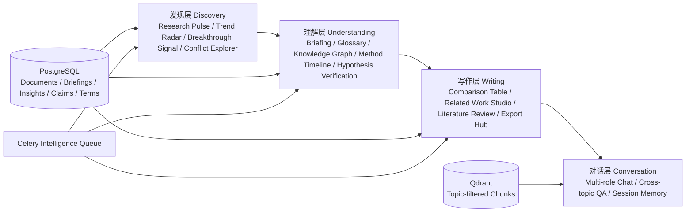

# TaskRAG v1.3+ 惊喜感功能进一步开发文档（AI Coding Agent 版）

> 文档目标：在 TaskRAG v1.2 已实现能力之上，规划下一批“有生命感 / 有惊喜感 / 真实研究者会持续使用”的功能，并给出可直接交给 AI Coding Agent 执行的工程实现说明。  
> 适用范围：v1.3、v1.4、v1.5。  
> 当前基线：TaskRAG v1.2，已具备多源 fallback、自动剪枝、手动 picker、任务进度、UI 重设计、Briefing、Pulse、Reading Path、Gap Finder、Notes 等能力。  
> 生成日期：2026-05-17。  
> 修订：2026-05-17（v1.3.1）  
> 修订说明：  
> 1. UI 信息架构从原 §17 上移到 §2.3，与产品蓝图同处一节；  
> 2. 原 §18/§19 后端 + 前端文件清单合并精简为单个 §17；  
> 3. 新增 §18 LLM Prompt 模板库，提供可直接落地的 system / user / JSON schema；  
> 4. 新增 §19 可靠性、可观测性、成本控制，并吸收原 §21 LLM 与质量控制；  
> 5. 原 §22–§25 顺延为 §21–§24。

---

## 0. 给 AI Coding Agent 的总原则

本阶段不是继续“加更多按钮”，而是把 TaskRAG 从 **研究资料库** 升级为 **会主动发现、会组织知识、会帮用户产出内容的个人研究工作台**。

任何新增功能必须遵守以下硬约束：

1. **Topic 隔离永远优先**  
   所有 Topic 级数据必须先校验 `topics.user_id = current_user.id`。即使功能是“全局问答”或“跨课题分析”，也只能在当前用户拥有的 topic 集合内联合检索，绝对不能直接取消 `topic_ids` 过滤。

2. **Documents / Chunks 继续全局共享**  
   不要把 `documents`、`chunks` 改成用户私有表。用户私有状态放在 `user_document_states`、`research_notes`、`writing_projects` 等表里。

3. **重活走 Celery intelligence 队列**  
   Trend、Claim 抽取、Conflict 检测、Glossary、Related Work、Comparison、Graph relation 计算都属于 intelligence 功能，必须复用 `worker-intel`。当前 `worker-intel` 并发为 1，因此任务必须可中断、可重试、可限量。

4. **不要让 LLM 做无界 O(n²) 对比**  
   Contradiction / Claim Conflict 必须先用规则筛候选，再让 LLM 判断。禁止把一个 Topic 下所有论文两两丢给 LLM。

5. **所有“矛盾 / 突破 / 趋势”都必须显示证据和置信度**  
   UI 文案用“疑似冲突”“趋势信号”“突破候选”，不要用“事实矛盾”“已证伪”“确定突破”。

6. **引用元数据不能假设一定存在**  
   如果 `documents.metadata_json.references` 或 Semantic Scholar citations 不存在，Graph / Breakthrough 需要降级为弱关系图谱和本地信号。

7. **新增功能必须遵循现有拓展模式**  
   新功能 = `DB Model + Alembic Migration + Repository + Service + Celery Task + API Route + Schema + Frontend API + Component + Topic Tab/入口 + 测试`。

---

## 1. 当前 v1.2 基线理解

### 1.1 已实现的关键能力

TaskRAG v1.2 已经具备：

```text
用户 / Topic / Document / Chunk / TopicDocument
  ↓
多源采集：arXiv → OpenAlex → Semantic Scholar fallback
  ↓
PDF 解析 / chunk / bge-m3 embedding / Qdrant upsert
  ↓
Topic 级 RAG 问答
  ↓
Document Briefing / TopicDocumentInsight
  ↓
Daily Pulse / Reading Path / Gap Finder / Research Notes
  ↓
手动搜索 preview + 用户选择入库
  ↓
任务进度可见 + 失败原因展开
```

当前 Intelligence 表包括：

```text
document_briefings
topic_document_insights
user_document_states
topic_pulses
reading_paths
reading_path_items
research_insights
research_notes
```

这些表已经为后续的 Trend、Contradiction、Glossary、Related Work、Comparison 提供了基础素材。

### 1.2 已知待补能力

当前已知待改进项包括：

```text
Trend Radar 尚未实现
Contradiction Detector 尚未实现
Reading Path 目前启发式，不调 LLM
Webhook 未实现
文档上传仍是 stub
Graph / Timeline / Export Hub 尚未实现
```

本开发文档优先解决：

```text
Trend Radar
Claim Conflict Explorer（矛盾检测器的安全版）
Related Work Studio
Method Comparison Table
Knowledge Graph / Method Timeline
Concept Glossary
Hypothesis Verification
Export Hub
Multi-role Chat
Conversation Memory
```

---

## 2. 产品蓝图

### 2.1 四层体验模型



### 2.2 目标用户路径

v1.3+ 的理想日常体验：

```text
早上打开 Topic
  ↓
看到 Research Pulse + Trend Radar：今天领域发生了什么变化
  ↓
看到疑似争议 / 新兴方法：哪些值得注意
  ↓
点击某个趋势词：看到相关论文、方法时间线、定义卡片
  ↓
选择 3-5 篇论文：生成方法对比表
  ↓
输入自己的研究想法：生成 Related Work 草稿
  ↓
把结果导出 BibTeX / Markdown / Obsidian / Notion CSV
```

产品目标不是“系统回答我的问题”，而是让用户感觉：

```text
系统每天都在替我看领域变化，
能指出我不知道的新方向，
能帮我发现争议和空白，
能把散乱文献转成可写作的材料。
```

### 2.3 UI 信息架构

现有 Topic Detail 已经有多个 Tab。为了避免“按钮变多但体验散”，建议把 v1.3+ 的所有新能力收敛到下面这套 Tab 结构内：

```text
Overview     Pulse + 今日新增 + 重要提醒
Chat         Topic QA + 多角色模式
Library      文档列表 + Briefing + Picker
Radar        Trend Radar + Conflict Explorer + Hypothesis Verification
Studio       Comparison + Related Work + Export
Map          Knowledge Graph + Method Timeline + Glossary
Notes        Research Notes + pinned memories
Tasks        任务日志
Settings     Topic settings
```

如果 Tab 数量仍偏多，可以再聚合为：

```text
Overview / Chat / Library / Research / Studio / Tasks / Settings
```

其中 `Research` 内部再做二级 segment：

```text
Radar | Conflicts | Map | Glossary
```

设计原则：

```text
1. 不要为每个新功能单独开 Tab；新功能默认进入 Radar / Studio / Map 三个工作区之一。
2. 任何 Tab 在数据为空时必须有 empty state，提示用户如何触发。
3. Tab 之间共享 selection（如 Library 选中的文档可在 Studio 直接 Compare）。
4. 跨 Tab 跳转必须保留来源上下文（如 Conflict Card → Compare 时自动带入 claim 对应的 documents）。
```

---

## 3. 总体优先级

### 3.1 推荐版本规划

| 版本 | 目标 | 功能 |
|---|---|---|
| v1.3 | 研究雷达与争议发现 | Trend Radar、Claim Conflict Explorer、Hypothesis Verification、Multi-role Chat |
| v1.4 | 研究写作与结构化产出 | Method Comparison Table、Related Work Studio、Export Hub |
| v1.5 | 可视化知识组织 | Knowledge Graph、Method Timeline、Concept Glossary、Breakthrough Signal |
| v2.0 | 外部集成和协作 | Notion/Zotero/GitHub 集成、Webhook、团队 Workspace |

### 3.2 实际 Sprint 顺序

虽然用户感知上最惊喜的是 Trend Radar + 矛盾检测器，但工程上建议这样做：

```text
Sprint 0：Intelligence Foundation
- term extraction 基础能力
- claim extraction 基础能力
- LLM JSON safe parse 工具增强
- intelligence task status 统一包装

Sprint 1：Trend Radar MVP
- 统计型趋势，不依赖 LLM 或只少量 LLM 解释
- Heatmap + 趋势卡片

Sprint 2：Claim Conflict Explorer MVP
- Claim 抽取
- 候选 pair 筛选
- LLM 判断 supports/conflicts/qualifies/unrelated
- UI 争议卡片

Sprint 3：Writing Studio MVP
- Method Comparison Table
- Related Work Draft
- Export BibTeX / Markdown / CSV

Sprint 4：Visual Knowledge MVP
- Knowledge Graph 弱关系版
- Method Timeline
- Concept Glossary hover card

Sprint 5：Conversation Enhancement
- Multi-role Chat
- Cross-topic QA（仅用户自有 topic）
- Session Summary Memory
```

---

## 4. 统一数据底座设计

v1.3+ 的多个功能会反复用到“术语”“主张”“关系”“写作来源”。不要每个功能各自抽一次。

### 4.1 新增核心表总览

```text
topic_terms
term_occurrences
topic_trend_snapshots
topic_trend_items
paper_claims
claim_relations
document_relations
topic_glossary_terms
comparison_sessions
comparison_items
writing_projects
writing_project_sources
export_jobs
chat_session_summaries
llm_usage_logs
```

### 4.2 Migration 建议

```text
0003_terms_and_trends.py
0004_claims_and_conflicts.py
0005_writing_and_exports.py
0006_graph_glossary_memory.py
```

不要一次 migration 塞所有功能。每个 Sprint 一个 migration，方便回滚。

---

## 5. Sprint 0：Intelligence Foundation

### 5.1 目标

在正式做 Trend / Conflict 之前，先补一层通用智能数据抽取能力：

```text
DocumentBriefing / Document / Chunk
  ↓
Term Extraction
Claim Extraction
Relation Candidate Generation
  ↓
Trend / Conflict / Graph / Glossary / Related Work 共用
```

### 5.2 新增文件

```text
backend/app/services/intel_utils.py
backend/app/services/term_service.py
backend/app/services/claim_service.py
backend/app/schemas/intel_common.py
backend/app/tasks/intel_tasks.py  # 追加任务，不新建 worker
```

### 5.3 LLM JSON safe parse 工具

新增通用方法：

```python
def safe_parse_json_object(raw: str, fallback: dict) -> dict:
    """从 LLM 输出中提取 JSON object，失败时返回 fallback。"""


def normalize_confidence(value: Any, default: float = 0.5) -> float:
    """将 LLM 置信度规整到 0-1。"""


def truncate_for_llm(text: str, max_chars: int = 12000) -> str:
    """统一截断，避免 prompt 爆掉。"""
```

### 5.4 LLM 使用日志

后续智能功能会增加成本，建议新增：

```sql
CREATE TABLE llm_usage_logs (
    id BIGSERIAL PRIMARY KEY,
    user_id BIGINT NULL REFERENCES users(id) ON DELETE SET NULL,
    topic_id BIGINT NULL REFERENCES topics(id) ON DELETE SET NULL,
    document_id BIGINT NULL REFERENCES documents(id) ON DELETE SET NULL,
    feature VARCHAR(64) NOT NULL,
    provider VARCHAR(64) NOT NULL,
    model VARCHAR(128) NOT NULL,
    prompt_tokens INTEGER NULL,
    completion_tokens INTEGER NULL,
    estimated_cost NUMERIC(12, 6) NULL,
    latency_ms INTEGER NULL,
    success BOOLEAN NOT NULL DEFAULT TRUE,
    error_msg TEXT NULL,
    created_at TIMESTAMPTZ NOT NULL DEFAULT now()
);

CREATE INDEX ix_llm_usage_logs_user_created ON llm_usage_logs(user_id, created_at DESC);
CREATE INDEX ix_llm_usage_logs_feature_created ON llm_usage_logs(feature, created_at DESC);
```

### 5.5 配置项

```python
# app/core/config.py
intel_max_documents_per_topic: int = 200
intel_max_claims_per_document: int = 8
intel_max_conflict_pairs_per_run: int = 80
trend_default_window_days: int = 180
trend_min_term_occurrences: int = 2
trend_min_docs: int = 5
```

---

## 6. Sprint 1：Trend Radar

### 6.1 产品定位

Trend Radar 是 Topic 的“研究脉搏可视化”。用户不需要问问题，就能看到：

```text
最近 60 天哪些方法词在升温？
哪些方向开始衰退？
哪些关键词是新出现的？
这些趋势对应哪些论文？
```

### 6.2 MVP 范围

v1.3 MVP 先做统计型 Trend，不依赖大量 LLM：

```text
输入：Topic 内 documents + document_briefings + topic_document_insights
输出：时间分桶词频、增长率、趋势状态、代表论文
UI：Heatmap + Trend Cards + Evidence Papers
```

趋势状态：

```text
emerging    近 60 天新出现，且出现次数 >= threshold
rising      最近窗口频次 / 上一窗口频次显著上升
hot         总频次高且最近仍活跃
cooling     总频次高但最近下降
stable      稳定出现
```

### 6.3 术语来源

优先从结构化字段提取：

```text
document_briefings.method
document_briefings.contributions
document_briefings.datasets
document_briefings.metrics
documents.title
documents.abstract
topic_document_insights.why_read
```

不要直接从全文 chunks 全量统计，噪声太大。

### 6.4 新增表

```sql
CREATE TABLE topic_terms (
    id BIGSERIAL PRIMARY KEY,
    topic_id BIGINT NOT NULL REFERENCES topics(id) ON DELETE CASCADE,
    term VARCHAR(255) NOT NULL,
    normalized_term VARCHAR(255) NOT NULL,
    term_type VARCHAR(32) NOT NULL DEFAULT 'keyword',
    aliases_json JSONB NOT NULL DEFAULT '[]'::jsonb,
    first_seen_document_id BIGINT NULL REFERENCES documents(id) ON DELETE SET NULL,
    first_seen_at TIMESTAMPTZ NULL,
    last_seen_at TIMESTAMPTZ NULL,
    total_count INTEGER NOT NULL DEFAULT 0,
    created_at TIMESTAMPTZ NOT NULL DEFAULT now(),
    updated_at TIMESTAMPTZ NOT NULL DEFAULT now(),
    UNIQUE(topic_id, normalized_term)
);

CREATE INDEX ix_topic_terms_topic_type ON topic_terms(topic_id, term_type);

CREATE TABLE term_occurrences (
    id BIGSERIAL PRIMARY KEY,
    topic_id BIGINT NOT NULL REFERENCES topics(id) ON DELETE CASCADE,
    term_id BIGINT NOT NULL REFERENCES topic_terms(id) ON DELETE CASCADE,
    document_id BIGINT NOT NULL REFERENCES documents(id) ON DELETE CASCADE,
    source_field VARCHAR(64) NOT NULL,
    published_at TIMESTAMPTZ NULL,
    weight FLOAT NOT NULL DEFAULT 1.0,
    evidence_text TEXT NULL,
    created_at TIMESTAMPTZ NOT NULL DEFAULT now(),
    UNIQUE(topic_id, term_id, document_id, source_field)
);

CREATE INDEX ix_term_occurrences_topic_published ON term_occurrences(topic_id, published_at);
CREATE INDEX ix_term_occurrences_term_published ON term_occurrences(term_id, published_at);

CREATE TABLE topic_trend_snapshots (
    id BIGSERIAL PRIMARY KEY,
    topic_id BIGINT NOT NULL REFERENCES topics(id) ON DELETE CASCADE,
    window_days INTEGER NOT NULL,
    bucket_unit VARCHAR(16) NOT NULL DEFAULT 'month',
    status VARCHAR(32) NOT NULL DEFAULT 'pending',
    summary_md TEXT NULL,
    heatmap_json JSONB NOT NULL DEFAULT '{}'::jsonb,
    generated_at TIMESTAMPTZ NULL,
    created_at TIMESTAMPTZ NOT NULL DEFAULT now()
);

CREATE INDEX ix_topic_trend_snapshots_topic_created ON topic_trend_snapshots(topic_id, created_at DESC);

CREATE TABLE topic_trend_items (
    id BIGSERIAL PRIMARY KEY,
    snapshot_id BIGINT NOT NULL REFERENCES topic_trend_snapshots(id) ON DELETE CASCADE,
    topic_id BIGINT NOT NULL REFERENCES topics(id) ON DELETE CASCADE,
    term_id BIGINT NOT NULL REFERENCES topic_terms(id) ON DELETE CASCADE,
    trend_status VARCHAR(32) NOT NULL,
    frequency INTEGER NOT NULL DEFAULT 0,
    previous_frequency INTEGER NOT NULL DEFAULT 0,
    growth_rate FLOAT NULL,
    confidence FLOAT NOT NULL DEFAULT 0.5,
    evidence_document_ids JSONB NOT NULL DEFAULT '[]'::jsonb,
    explanation TEXT NULL,
    created_at TIMESTAMPTZ NOT NULL DEFAULT now()
);

CREATE INDEX ix_topic_trend_items_topic_status ON topic_trend_items(topic_id, trend_status);
```

### 6.5 计算逻辑

`services/trend_service.py`：

```python
class TrendService:
    def extract_terms_for_topic(topic_id: int) -> None:
        # 从 briefing/title/abstract/insight 中抽取 term
        # 规则：保留 2-5 token 短语、驼峰/大写缩写、模型名、数据集名、方法名
        # 可选：用 LLM 对 top terms 做归一化和 term_type 分类

    def generate_trend_snapshot(topic_id: int, window_days: int = 180) -> TrendSnapshot:
        # 1. 加载 topic 下 term_occurrences
        # 2. 按 month/week 分桶
        # 3. 计算 current_freq / previous_freq / growth_rate
        # 4. 打 trend_status
        # 5. 写 topic_trend_snapshots + topic_trend_items
```

增长率建议：

```python
growth_rate = (current_count + 1) / (previous_count + 1)
```

趋势规则：

```python
if previous_count == 0 and current_count >= 2:
    status = "emerging"
elif growth_rate >= 2.0 and current_count >= 3:
    status = "rising"
elif current_count >= 5:
    status = "hot"
elif previous_count >= 3 and current_count == 0:
    status = "cooling"
else:
    status = "stable"
```

### 6.6 Celery 任务

```python
@app.task(name="generate_topic_trend_task", queue="intelligence")
def generate_topic_trend_task(topic_id: int, window_days: int = 180):
    ...

@app.task(name="refresh_topic_terms_task", queue="intelligence")
def refresh_topic_terms_task(topic_id: int):
    ...
```

触发方式：

```text
1. 用户手动点击 Generate Trend
2. 每日 Pulse 生成后，如果当天无 trend snapshot，可延迟生成
3. 新文档入库并完成 briefing 后，可只更新 term occurrences，不立即生成完整 trend
```

### 6.7 API

```http
GET  /api/v1/topics/{tid}/trends/latest?window_days=180
GET  /api/v1/topics/{tid}/trends
GET  /api/v1/topics/{tid}/trends/{snapshot_id}
POST /api/v1/topics/{tid}/trends/generate
GET  /api/v1/topics/{tid}/terms?q=&type=&limit=50
GET  /api/v1/topics/{tid}/terms/{term_id}/documents
```

### 6.8 前端

新增：

```text
frontend/src/api/trends.ts
frontend/src/components/TrendRadarView.tsx
frontend/src/components/TrendHeatmap.tsx
frontend/src/components/TrendItemCard.tsx
frontend/src/components/TermDocumentDrawer.tsx
```

Topic Detail 加一个新 Tab：

```text
Radar
```

Radar Tab 结构：

```text
[Trend Summary]
- 近 180 天趋势摘要
- 新兴方法 / 升温方法 / 降温方向

[Heatmap]
- 横轴：月份
- 纵轴：term
- cell intensity：frequency

[Trend Cards]
- term
- status badge
- growth_rate
- explanation
- evidence papers
- action: 查看论文 / 加入 Related Work / 基于该趋势找 Gap
```

### 6.9 验收标准

1. Topic 下至少 5 篇文档时可生成 Trend Radar。
2. Heatmap 至少显示 top 20 terms。
3. 点击 term 可看到相关文档列表。
4. Trend 生成失败时不影响 Pulse / QA。
5. 不同用户不能访问彼此 Topic 的 trend snapshot。
6. 没有足够数据时显示“数据不足”，不要编造趋势。

---

## 7. Sprint 2：Claim Conflict Explorer（矛盾检测器安全版）

### 7.1 产品定位

用户想看到的不只是“哪些论文相关”，而是：

```text
哪些论文在相似问题上得出了不同结论？
为什么它们看起来冲突？
冲突是否只是因为数据集、指标、设置不同？
```

功能名称建议：

```text
Claim Conflict Explorer
中文：争议探索 / 疑似冲突
```

不要在 UI 中直接叫“论文矛盾已检测”。

### 7.2 两阶段架构

```text
Stage 1：Claim Extraction
DocumentBriefing / full_text chunks
  ↓
抽取 paper_claims

Stage 2：Claim Relation Detection
候选 pair 筛选
  ↓
LLM 判断 relation_type
  ↓
claim_relations
  ↓
research_insights(insight_type='contradiction') 用于前端摘要展示
```

### 7.3 新增表

```sql
CREATE TABLE paper_claims (
    id BIGSERIAL PRIMARY KEY,
    topic_id BIGINT NOT NULL REFERENCES topics(id) ON DELETE CASCADE,
    document_id BIGINT NOT NULL REFERENCES documents(id) ON DELETE CASCADE,
    claim_text TEXT NOT NULL,
    claim_type VARCHAR(32) NOT NULL,
    method_name VARCHAR(255) NULL,
    dataset_name VARCHAR(255) NULL,
    metric_name VARCHAR(255) NULL,
    result_value VARCHAR(255) NULL,
    setting_text TEXT NULL,
    evidence_chunk_id BIGINT NULL REFERENCES chunks(id) ON DELETE SET NULL,
    evidence_text TEXT NULL,
    confidence FLOAT NOT NULL DEFAULT 0.5,
    source VARCHAR(32) NOT NULL DEFAULT 'llm',
    created_at TIMESTAMPTZ NOT NULL DEFAULT now()
);

CREATE INDEX ix_paper_claims_topic_doc ON paper_claims(topic_id, document_id);
CREATE INDEX ix_paper_claims_topic_type ON paper_claims(topic_id, claim_type);
CREATE INDEX ix_paper_claims_dataset_metric ON paper_claims(topic_id, dataset_name, metric_name);

CREATE TABLE claim_relations (
    id BIGSERIAL PRIMARY KEY,
    topic_id BIGINT NOT NULL REFERENCES topics(id) ON DELETE CASCADE,
    claim_a_id BIGINT NOT NULL REFERENCES paper_claims(id) ON DELETE CASCADE,
    claim_b_id BIGINT NOT NULL REFERENCES paper_claims(id) ON DELETE CASCADE,
    relation_type VARCHAR(32) NOT NULL,
    conflict_type VARCHAR(64) NULL,
    reason_md TEXT NOT NULL,
    normalized_setting_md TEXT NULL,
    confidence FLOAT NOT NULL DEFAULT 0.5,
    needs_human_check BOOLEAN NOT NULL DEFAULT TRUE,
    created_at TIMESTAMPTZ NOT NULL DEFAULT now(),
    UNIQUE(claim_a_id, claim_b_id)
);

CREATE INDEX ix_claim_relations_topic_type ON claim_relations(topic_id, relation_type);
CREATE INDEX ix_claim_relations_confidence ON claim_relations(topic_id, confidence DESC);
```

`claim_type` 可取值：

```text
result
method
limitation
assumption
comparison
dataset_observation
```

`relation_type` 可取值：

```text
supports
conflicts
qualifies
same_claim
unrelated
insufficient_info
```

### 7.4 Claim 抽取 Prompt

输入：`document_briefings` + 关键 chunks。输出严格 JSON：

```json
{
  "claims": [
    {
      "claim_text": "The method improves accuracy on KITTI compared with RAFT-Stereo.",
      "claim_type": "result",
      "method_name": "...",
      "dataset_name": "KITTI",
      "metric_name": "EPE",
      "result_value": "...",
      "setting_text": "same training split / same benchmark if available",
      "evidence_text": "short quoted evidence",
      "confidence": 0.74
    }
  ]
}
```

约束：

```text
只抽取文档中明确出现的 claim。
不能把模型自己的推断写成 claim。
每篇文档最多 8 条 claim。
优先抽 result / limitation / comparison 类型。
```

### 7.5 候选 Pair 筛选

禁止全量两两比较。候选规则：

```python
candidate_pairs = []

# 同数据集 + 同指标
same_dataset_metric = group_by(dataset_name, metric_name)

# 同方法名 / 基线名
same_method = group_by(method_name)

# Claim 类型优先 result/comparison/limitation
claim_type in {"result", "comparison", "limitation"}

# 同一篇文档内部不比较
claim_a.document_id != claim_b.document_id

# 限制每次最多 80 对
candidate_pairs = rank_by_overlap_and_recency(... )[:settings.intel_max_conflict_pairs_per_run]
```

### 7.6 Relation 判断 Prompt

输出：

```json
{
  "relation_type": "conflicts",
  "conflict_type": "metric_result_disagreement",
  "reason_md": "Both claims discuss KITTI EPE under similar evaluation language, but claim A reports ... while claim B reports ...",
  "normalized_setting_md": "Dataset: KITTI; Metric: EPE; Setting uncertainty: training split not fully specified.",
  "confidence": 0.68,
  "needs_human_check": true
}
```

强制规则：

```text
如果数据集、指标、设置不同，优先 relation_type=qualifies，而不是 conflicts。
如果证据不足，返回 insufficient_info。
只有在同一任务 / 相近设置 / 明确相反结论时才返回 conflicts。
```

### 7.7 Celery 任务

```python
@app.task(name="extract_document_claims_task", queue="intelligence")
def extract_document_claims_task(topic_id: int, document_id: int):
    ...

@app.task(name="detect_topic_claim_conflicts_task", queue="intelligence")
def detect_topic_claim_conflicts_task(topic_id: int):
    ...
```

触发方式：

```text
1. 新 document 完成 briefing 后，延迟抽 claim
2. 用户点击“检测争议”时，对 Topic 运行 conflict detection
3. 每日 Pulse 可读取高置信 conflict，但不自动生成全部 pair
```

### 7.8 API

```http
GET  /api/v1/topics/{tid}/claims?document_id=&type=&limit=50
POST /api/v1/topics/{tid}/claims/extract
GET  /api/v1/topics/{tid}/conflicts?min_confidence=0.5
GET  /api/v1/topics/{tid}/conflicts/{relation_id}
POST /api/v1/topics/{tid}/conflicts/detect
PATCH /api/v1/topics/{tid}/conflicts/{relation_id}/review
```

### 7.9 前端

新增：

```text
frontend/src/components/ConflictExplorerView.tsx
frontend/src/components/ConflictCard.tsx
frontend/src/components/ClaimEvidenceDrawer.tsx
```

UI 文案：

```text
疑似冲突
可能只是实验设置不同
需要人工确认
证据片段
涉及论文
```

卡片结构：

```text
[疑似冲突] Selective-IGEV vs RAFT-Stereo Variant
置信度：0.68
冲突点：两篇论文对 KITTI EPE 改进幅度描述不同
可能原因：训练数据 / split 未完全一致
证据：Claim A / Claim B
操作：查看证据 / 加入对比 / Pin 到笔记 / 标记为已确认 / 标记为误报
```

### 7.10 验收标准

1. 只有 Topic 内文档参与 claim extraction。
2. Conflict 输出必须绑定 `claim_a_id`、`claim_b_id`、证据文本和文档。
3. UI 中不出现“论文 A 错了”这类断言。
4. 数据不足时显示“未发现高置信疑似冲突”。
5. 同一用户可对 conflict 做人工 review。
6. LLM 失败时不影响 QA / Pulse。

---

## 8. Sprint 2.5：Hypothesis Verification

### 8.1 产品定位

用户输入一个研究假设，系统从 Topic 知识库中找：

```text
支持证据
反对证据
不确定 / 需要进一步验证
```

这比普通问答更适合科研选题。

### 8.2 API

```http
POST /api/v1/topics/{tid}/hypotheses/verify
```

请求：

```json
{
  "hypothesis": "基于迭代优化的方法在稠密场景下优于端到端方法",
  "save_as_insight": true
}
```

响应：

```json
{
  "hypothesis": "...",
  "verdict": "mixed",
  "supporting_evidence": [
    {"document_id": 1, "chunk_id": 12, "claim_id": 5, "summary": "..."}
  ],
  "opposing_evidence": [],
  "uncertain_points": ["缺少统一数据集下的直接比较"],
  "suggested_next_steps": ["优先查找 KITTI / Scene Flow 同设置比较"],
  "confidence": 0.61
}
```

### 8.3 实现

复用：

```text
Qdrant topic-filtered retrieval
paper_claims
claim_relations
research_insights
```

保存到：

```text
research_insights.insight_type = 'hypothesis'
```

### 8.4 前端入口

```text
Radar Tab → Verify a Hypothesis
Chat 输入框快捷命令 → /verify
Gap Finder 结果页 → “验证这个研究机会”
```

---

## 9. Sprint 3：Method Comparison Table

### 9.1 产品定位

用户选择 N 篇论文，系统自动生成可复制的对比矩阵。

这是研究者最常用、也最容易产生留存的功能之一。

### 9.2 新增表

```sql
CREATE TABLE comparison_sessions (
    id BIGSERIAL PRIMARY KEY,
    user_id BIGINT NOT NULL REFERENCES users(id) ON DELETE CASCADE,
    topic_id BIGINT NOT NULL REFERENCES topics(id) ON DELETE CASCADE,
    title VARCHAR(255) NOT NULL,
    status VARCHAR(32) NOT NULL DEFAULT 'pending',
    document_ids JSONB NOT NULL DEFAULT '[]'::jsonb,
    result_json JSONB NOT NULL DEFAULT '{}'::jsonb,
    result_md TEXT NULL,
    latex_table TEXT NULL,
    error_msg TEXT NULL,
    created_at TIMESTAMPTZ NOT NULL DEFAULT now(),
    updated_at TIMESTAMPTZ NOT NULL DEFAULT now()
);

CREATE INDEX ix_comparison_sessions_user_topic ON comparison_sessions(user_id, topic_id, created_at DESC);

CREATE TABLE comparison_items (
    id BIGSERIAL PRIMARY KEY,
    comparison_session_id BIGINT NOT NULL REFERENCES comparison_sessions(id) ON DELETE CASCADE,
    document_id BIGINT NOT NULL REFERENCES documents(id) ON DELETE CASCADE,
    role VARCHAR(32) NOT NULL DEFAULT 'target',
    order_index INTEGER NOT NULL DEFAULT 0,
    note TEXT NULL,
    UNIQUE(comparison_session_id, document_id)
);
```

### 9.3 默认比较维度

```text
method_name
problem
core_idea
architecture
training_data
datasets
metrics
main_results
strengths
limitations
code_available
best_use_case
relation_to_others
```

### 9.4 API

```http
POST /api/v1/topics/{tid}/comparisons
GET  /api/v1/topics/{tid}/comparisons
GET  /api/v1/topics/{tid}/comparisons/{cid}
POST /api/v1/topics/{tid}/comparisons/{cid}/generate
POST /api/v1/topics/{tid}/comparisons/{cid}/export/markdown
POST /api/v1/topics/{tid}/comparisons/{cid}/export/latex
```

请求：

```json
{
  "title": "RAFT-Stereo vs IGEV vs Selective-IGEV",
  "document_ids": [12, 19, 25],
  "dimensions": ["method", "dataset", "metric", "limitation"]
}
```

### 9.5 生成逻辑

优先使用已有结构化数据：

```text
document_briefings.problem
document_briefings.method
document_briefings.contributions
document_briefings.experiments
document_briefings.limitations
document_briefings.datasets
document_briefings.metrics
```

只有信息缺失时，再检索 chunks 并调用 LLM 补齐。

### 9.6 前端入口

```text
DocumentList 多选 → Compare
Trend term 文档列表 → Compare selected
Conflict Card → Compare involved papers
Related Work Studio → Insert comparison table
```

### 9.7 验收标准

1. 只能比较当前用户 Topic 内的 documents。
2. 每个表格 cell 尽量包含来源 document_id。
3. 可导出 Markdown 和 LaTeX。
4. 如果某一维度缺失，显示 `N/A`，不要编造。

---

## 10. Sprint 3：Related Work Studio

### 10.1 产品定位

用户输入自己的研究问题 / 方法描述，系统生成带引用的 Related Work 草稿。

目标不是“直接帮用户写论文”，而是提供一个可修改的起点：

```text
按方法类别组织
保留引用
明确哪些证据来自 Topic 知识库
没有证据就不写
```

### 10.2 新增表

```sql
CREATE TABLE writing_projects (
    id BIGSERIAL PRIMARY KEY,
    user_id BIGINT NOT NULL REFERENCES users(id) ON DELETE CASCADE,
    topic_id BIGINT NOT NULL REFERENCES topics(id) ON DELETE CASCADE,
    title VARCHAR(255) NOT NULL,
    writing_type VARCHAR(32) NOT NULL DEFAULT 'related_work',
    user_research_question TEXT NULL,
    user_method_description TEXT NULL,
    scope_json JSONB NOT NULL DEFAULT '{}'::jsonb,
    outline_json JSONB NOT NULL DEFAULT '{}'::jsonb,
    draft_md TEXT NULL,
    citation_json JSONB NOT NULL DEFAULT '[]'::jsonb,
    status VARCHAR(32) NOT NULL DEFAULT 'draft',
    error_msg TEXT NULL,
    created_at TIMESTAMPTZ NOT NULL DEFAULT now(),
    updated_at TIMESTAMPTZ NOT NULL DEFAULT now()
);

CREATE INDEX ix_writing_projects_user_topic ON writing_projects(user_id, topic_id, created_at DESC);

CREATE TABLE writing_project_sources (
    id BIGSERIAL PRIMARY KEY,
    writing_project_id BIGINT NOT NULL REFERENCES writing_projects(id) ON DELETE CASCADE,
    document_id BIGINT NOT NULL REFERENCES documents(id) ON DELETE CASCADE,
    chunk_id BIGINT NULL REFERENCES chunks(id) ON DELETE SET NULL,
    claim_id BIGINT NULL REFERENCES paper_claims(id) ON DELETE SET NULL,
    role VARCHAR(32) NOT NULL DEFAULT 'supporting',
    citation_label VARCHAR(32) NULL,
    created_at TIMESTAMPTZ NOT NULL DEFAULT now()
);
```

### 10.3 工作流

```text
Step 1：用户输入研究问题 / 方法描述
Step 2：选择材料范围
        - 全部 Topic
        - 最近 30 / 90 / 180 天
        - 收藏论文
        - 已读论文
        - 某个 Trend term
        - 某个 Comparison Session
Step 3：系统召回并分组 source papers
Step 4：生成 outline
Step 5：生成 draft
Step 6：用户编辑 / 导出
```

### 10.4 API

```http
POST /api/v1/topics/{tid}/writing-projects
GET  /api/v1/topics/{tid}/writing-projects
GET  /api/v1/topics/{tid}/writing-projects/{wid}
PATCH /api/v1/topics/{tid}/writing-projects/{wid}
POST /api/v1/topics/{tid}/writing-projects/{wid}/select-sources
POST /api/v1/topics/{tid}/writing-projects/{wid}/generate-outline
POST /api/v1/topics/{tid}/writing-projects/{wid}/generate-draft
POST /api/v1/topics/{tid}/writing-projects/{wid}/export/markdown
```

### 10.5 Citation 约束

强制要求：

```text
1. 草稿中每个具体 claim 必须绑定 citation。
2. citation 必须来自 writing_project_sources。
3. citation_json 必须记录 document_id / chunk_id / claim_id。
4. LLM 不能凭空补论文。
5. 没有足够证据时写“当前 Topic 中未找到充分证据”。
```

引用格式：

```text
Recent iterative stereo methods improve disparity refinement through recurrent updates [1], while transformer-based variants emphasize long-range correspondence modeling [2].
```

`citation_json`：

```json
[
  {
    "label": "[1]",
    "document_id": 12,
    "chunk_id": 88,
    "claim_id": 31,
    "title": "...",
    "url": "..."
  }
]
```

### 10.6 前端

新增：

```text
frontend/src/components/WritingStudioView.tsx
frontend/src/components/SourceSelector.tsx
frontend/src/components/OutlineEditor.tsx
frontend/src/components/DraftEditor.tsx
frontend/src/components/CitationList.tsx
```

建议把 `Comparison`、`Related Work`、`Export` 放进一个新 Tab：

```text
Studio
```

不要再为每个功能单独加 Tab，避免 Topic Detail 过载。

### 10.7 验收标准

1. 草稿引用都能追溯到 Topic 内文档。
2. 用户可手动选择 / 删除 source papers。
3. 草稿可导出 Markdown。
4. 生成失败不丢失用户输入。
5. 不同用户不能访问彼此 writing project。

---

## 11. Sprint 3：Export Hub

### 11.1 产品定位

Export Hub 是低成本高留存功能。用户一旦把 TaskRAG 输出接入自己的 Notion / Obsidian / LaTeX / BibTeX 工作流，就更容易持续使用。

### 11.2 支持格式

MVP：

```text
BibTeX
Markdown
Obsidian Vault ZIP
Notion CSV
LaTeX comparison table
```

### 11.3 API

```http
POST /api/v1/topics/{tid}/exports/bibtex
POST /api/v1/topics/{tid}/exports/markdown-vault
POST /api/v1/topics/{tid}/exports/notion-csv
POST /api/v1/topics/{tid}/exports/comparison-latex
GET  /api/v1/topics/{tid}/exports/{export_id}/download
```

### 11.4 新增表

```sql
CREATE TABLE export_jobs (
    id BIGSERIAL PRIMARY KEY,
    user_id BIGINT NOT NULL REFERENCES users(id) ON DELETE CASCADE,
    topic_id BIGINT NOT NULL REFERENCES topics(id) ON DELETE CASCADE,
    export_type VARCHAR(32) NOT NULL,
    status VARCHAR(32) NOT NULL DEFAULT 'pending',
    scope_json JSONB NOT NULL DEFAULT '{}'::jsonb,
    file_path TEXT NULL,
    error_msg TEXT NULL,
    created_at TIMESTAMPTZ NOT NULL DEFAULT now(),
    finished_at TIMESTAMPTZ NULL
);

CREATE INDEX ix_export_jobs_user_topic ON export_jobs(user_id, topic_id, created_at DESC);
```

### 11.5 Obsidian Vault Markdown 模板

每篇论文一个 `.md`：

```markdown
---
title: "{{title}}"
source: "{{source}}"
published_at: "{{published_at}}"
url: "{{url}}"
tags: [{{method_tags}}, {{dataset_tags}}]
status: "{{user_status}}"
---

# {{title}}

## One sentence
{{one_sentence_summary}}

## Problem
{{problem}}

## Method
{{method}}

## Contributions
{{contributions}}

## Limitations
{{limitations}}

## Related
{{wikilinks}}
```

### 11.6 BibTeX 生成规则

优先级：

```text
metadata_json.bibtex
DOI / arXiv ID
source + external_id
normalized title
```

如果没有完整元数据，生成最小 BibTeX：

```bibtex
@article{source_external_id,
  title = {...},
  author = {...},
  year = {...},
  url = {...}
}
```

---

## 12. Sprint 4：Knowledge Graph

### 12.1 产品定位

知识图谱提供视觉冲击，但不能为了好看而编关系。MVP 采用“弱关系图谱”：

```text
有 citation metadata → cites 边
没有 citation metadata → same_method / same_dataset / same_term / semantic_similar 边
```

### 12.2 新增表

```sql
CREATE TABLE document_relations (
    id BIGSERIAL PRIMARY KEY,
    topic_id BIGINT NOT NULL REFERENCES topics(id) ON DELETE CASCADE,
    source_document_id BIGINT NOT NULL REFERENCES documents(id) ON DELETE CASCADE,
    target_document_id BIGINT NOT NULL REFERENCES documents(id) ON DELETE CASCADE,
    relation_type VARCHAR(32) NOT NULL,
    confidence FLOAT NOT NULL DEFAULT 0.5,
    evidence_json JSONB NOT NULL DEFAULT '{}'::jsonb,
    created_at TIMESTAMPTZ NOT NULL DEFAULT now(),
    UNIQUE(topic_id, source_document_id, target_document_id, relation_type)
);

CREATE INDEX ix_document_relations_topic_type ON document_relations(topic_id, relation_type);
```

`relation_type`：

```text
cites
same_method
same_dataset
same_metric
same_term
compares_with
improves
semantic_similar
same_author
```

### 12.3 Graph 生成逻辑

```python
def build_document_graph(topic_id: int):
    # 1. 加载 Topic 内 documents + briefings + terms + claims
    # 2. 如果 metadata_json.references 存在，建立 cites 边
    # 3. 同 term / dataset / method 建弱关系边
    # 4. 可选：用 embedding 相似度找 semantic_similar top edges
    # 5. 限制节点和边数量，避免前端卡死
```

MVP 限制：

```text
节点最多 100
边最多 300
默认只显示高置信边
```

### 12.4 API

```http
GET  /api/v1/topics/{tid}/graph?relation_types=&limit_nodes=100
POST /api/v1/topics/{tid}/graph/generate
```

响应：

```json
{
  "nodes": [
    {
      "id": 12,
      "title": "...",
      "year": 2024,
      "source": "arxiv",
      "importance": 0.73,
      "reading_status": "unread"
    }
  ],
  "edges": [
    {
      "source": 12,
      "target": 19,
      "type": "same_method",
      "confidence": 0.81
    }
  ]
}
```

### 12.5 前端

新增：

```text
frontend/src/components/KnowledgeMapView.tsx
frontend/src/components/DocumentGraph.tsx
frontend/src/components/GraphFilterPanel.tsx
```

建议使用：

```text
D3 force-directed graph 或 React Flow
```

交互：

```text
点击节点 → DocumentDetailDrawer
点击边 → RelationEvidenceDrawer
框选节点 → Compare selected
按 relation_type 筛选
按年份 / 方法 / 阅读状态着色
```

---

## 13. Sprint 4：Method Timeline

### 13.1 产品定位

比完整图谱更清晰，适合展示“方法演化”。例如：

```text
2018 PSMNet → 2019 GwcNet → 2021 RAFT-Stereo → 2023 IGEV → 2024 Selective-IGEV
```

### 13.2 新增表

```sql
CREATE TABLE method_entities (
    id BIGSERIAL PRIMARY KEY,
    topic_id BIGINT NOT NULL REFERENCES topics(id) ON DELETE CASCADE,
    name VARCHAR(255) NOT NULL,
    normalized_name VARCHAR(255) NOT NULL,
    description TEXT NULL,
    first_seen_document_id BIGINT NULL REFERENCES documents(id) ON DELETE SET NULL,
    first_seen_at TIMESTAMPTZ NULL,
    aliases_json JSONB NOT NULL DEFAULT '[]'::jsonb,
    created_at TIMESTAMPTZ NOT NULL DEFAULT now(),
    UNIQUE(topic_id, normalized_name)
);

CREATE TABLE method_evolution_edges (
    id BIGSERIAL PRIMARY KEY,
    topic_id BIGINT NOT NULL REFERENCES topics(id) ON DELETE CASCADE,
    from_method_id BIGINT NOT NULL REFERENCES method_entities(id) ON DELETE CASCADE,
    to_method_id BIGINT NOT NULL REFERENCES method_entities(id) ON DELETE CASCADE,
    relation_type VARCHAR(32) NOT NULL,
    evidence_document_ids JSONB NOT NULL DEFAULT '[]'::jsonb,
    confidence FLOAT NOT NULL DEFAULT 0.5,
    created_at TIMESTAMPTZ NOT NULL DEFAULT now()
);
```

`relation_type`：

```text
extends
improves
combines
replaces
compares_with
inspired_by
```

### 13.3 数据来源

```text
document_briefings.method
document_briefings.contributions
topic_terms(term_type='method')
paper_claims(claim_type='method'/'comparison')
```

### 13.4 API

```http
GET  /api/v1/topics/{tid}/methods/timeline
POST /api/v1/topics/{tid}/methods/extract
GET  /api/v1/topics/{tid}/methods/{method_id}
```

### 13.5 UI

放在 `Map` 或 `Radar` Tab 内：

```text
Timeline row:
[2018] PSMNet
[2019] GwcNet
[2021] RAFT-Stereo
[2023] IGEV
[2024] Selective-IGEV

点击方法：
- 一句话定义
- 核心创新
- 代表论文
- 相关趋势
- 加入比较
```

---

## 14. Sprint 4：Concept Glossary

### 14.1 产品定位

让知识“随处可解释”。用户在 Briefing、Pulse、Related Work 草稿里看到术语时，可以 hover 展开：

```text
RAFT：一种基于 recurrent update 的 optical flow / stereo refinement 思路。
首次出现在：xxx
相关论文：xxx, yyy
相关方法：IGEV, Selective-IGEV
```

### 14.2 新增表

```sql
CREATE TABLE topic_glossary_terms (
    id BIGSERIAL PRIMARY KEY,
    topic_id BIGINT NOT NULL REFERENCES topics(id) ON DELETE CASCADE,
    term_id BIGINT NULL REFERENCES topic_terms(id) ON DELETE SET NULL,
    term VARCHAR(255) NOT NULL,
    normalized_term VARCHAR(255) NOT NULL,
    definition TEXT NOT NULL,
    term_type VARCHAR(32) NOT NULL DEFAULT 'concept',
    evidence_document_ids JSONB NOT NULL DEFAULT '[]'::jsonb,
    confidence FLOAT NOT NULL DEFAULT 0.5,
    created_at TIMESTAMPTZ NOT NULL DEFAULT now(),
    updated_at TIMESTAMPTZ NOT NULL DEFAULT now(),
    UNIQUE(topic_id, normalized_term)
);
```

### 14.3 API

```http
GET  /api/v1/topics/{tid}/glossary?q=&type=
POST /api/v1/topics/{tid}/glossary/generate
GET  /api/v1/topics/{tid}/glossary/{term_id}
```

### 14.4 前端

新增：

```text
GlossaryPanel
TermHoverCard
AnnotatedMarkdownRenderer
```

先在这些内容区启用 hover：

```text
BriefingPanel
PulseCard
TrendItemCard
WritingStudio DraftEditor
Chat assistant message
```

### 14.5 验收标准

1. 术语定义必须关联 evidence documents。
2. 不认识的术语不强行解释。
3. Hover 不影响 Markdown 阅读体验。

---

## 15. Sprint 5：Conversation Enhancement

### 15.1 Multi-role Chat

这是低成本高体验功能，主要改 prompt。

新增 `chat_mode`：

```text
default
mentor
beginner
debate
evidence_only
hypothesis_tester
```

API 调整：

```http
POST /api/v1/topics/{tid}/chat/sessions/{sid}/messages
```

请求增加：

```json
{
  "content": "...",
  "chat_mode": "mentor"
}
```

Prompt 差异：

```text
mentor：严格评价，指出假设漏洞和实验不足，必要时反问。
beginner：用类比解释，少术语，先讲直觉。
debate：分别列支持和反对观点，每条必须有 citation。
evidence_only：只输出证据，不做扩展推测。
hypothesis_tester：输出支持 / 反对 / 不确定三栏。
```

前端：

```text
Chat input 左侧加 ModeSelector
```

### 15.2 Cross-topic QA

用户可能会问：

```text
“我的 RAG 和 Agent 两个课题之间有什么交叉？”
```

实现时绝对不能 `global=true` 后取消过滤。正确做法：

```python
owned_topic_ids = topic_repo.list_ids_by_user(current_user.id)
qdrant_filter = topic_ids ANY owned_topic_ids
```

API：

```http
POST /api/v1/chat/cross-topic
```

请求：

```json
{
  "topic_ids": [1, 2],
  "question": "这两个方向有什么交叉？",
  "chat_mode": "debate"
}
```

响应 citation 必须带 `topic_id`：

```json
{
  "answer": "...",
  "citations": [
    {"topic_id": 1, "document_id": 12, "chunk_id": 88, "title": "..."}
  ]
}
```

### 15.3 Conversation Memory

新增表：

```sql
CREATE TABLE chat_session_summaries (
    id BIGSERIAL PRIMARY KEY,
    user_id BIGINT NOT NULL REFERENCES users(id) ON DELETE CASCADE,
    topic_id BIGINT NOT NULL REFERENCES topics(id) ON DELETE CASCADE,
    session_id BIGINT NOT NULL REFERENCES chat_sessions(id) ON DELETE CASCADE,
    summary_md TEXT NOT NULL,
    key_questions_json JSONB NOT NULL DEFAULT '[]'::jsonb,
    key_findings_json JSONB NOT NULL DEFAULT '[]'::jsonb,
    user_preferences_json JSONB NOT NULL DEFAULT '{}'::jsonb,
    generated_at TIMESTAMPTZ NOT NULL DEFAULT now(),
    UNIQUE(session_id)
);
```

Celery：

```python
@app.task(name="summarize_chat_session_task", queue="intelligence")
def summarize_chat_session_task(session_id: int):
    ...
```

触发：

```text
每个 session 新增 assistant message 后，如果距离上次 summary 超过 5 条消息，则延迟生成。
```

QA 注入规则：

```text
当前 session：最近 5 轮原文
历史 session：最多 3 条 summary，按相似度或最近时间选择
Pinned notes：继续保留高优先级
```

---

## 16. Breakthrough Signal

### 16.1 产品定位

“突破候选”不是简单引用量高，而是短期出现异常信号：

```text
短时间被多篇新论文引用
短时间被多个 Topic 采集
被用户收藏 / 加入比较 / 写作引用
与多个 emerging terms 相关
```

### 16.2 MVP 分级

P1：本地信号版，不依赖外部 citations API：

```text
recent_topic_associations
favorite_count
comparison_count
writing_source_count
trend_overlap_count
```

P2：Semantic Scholar citations API 版：

```text
external_citation_delta
influentialCitationCount
recent_citing_papers
```

### 16.3 新增表

```sql
CREATE TABLE breakthrough_signals (
    id BIGSERIAL PRIMARY KEY,
    topic_id BIGINT NOT NULL REFERENCES topics(id) ON DELETE CASCADE,
    document_id BIGINT NOT NULL REFERENCES documents(id) ON DELETE CASCADE,
    signal_type VARCHAR(32) NOT NULL,
    score FLOAT NOT NULL DEFAULT 0,
    reason_md TEXT NOT NULL,
    evidence_json JSONB NOT NULL DEFAULT '{}'::jsonb,
    status VARCHAR(32) NOT NULL DEFAULT 'candidate',
    created_at TIMESTAMPTZ NOT NULL DEFAULT now(),
    UNIQUE(topic_id, document_id, signal_type)
);
```

### 16.4 通知策略

只对高置信信号推送：

```text
score >= 0.8
AND document not dismissed
AND user notification setting enabled
```

通知标题：

```text
发现一个突破候选：{{paper_title}}
```

---

## 17. 文件清单（按功能模块汇总）

各 Sprint 章节已经列出本功能需要的文件。本节作为一个总览，方便估算 PR 边界与代码归类。**不要新建多个 worker；intelligence 相关任务统一注册到 `backend/app/tasks/intel_tasks.py`，由 `worker-intel` 消费。**

```text
backend/app/db/models/intel.py
  TopicTerm · TermOccurrence · TopicTrendSnapshot · TopicTrendItem
  PaperClaim · ClaimRelation · DocumentRelation
  TopicGlossaryTerm · MethodEntity · MethodEvolutionEdge
  ComparisonSession · ComparisonItem
  WritingProject · WritingProjectSource · ExportJob
  ChatSessionSummary · LLMUsageLog · BreakthroughSignal

backend/app/db/repositories/intel_repo.py
  Trend / Claim / Graph / Glossary / Comparison / Writing / Export / Memory
  各自提供 sync 和 async repository 两个版本

backend/app/services/
  intel_utils.py        # safe_parse_json_object / normalize_confidence / truncate_for_llm
  term_service.py       # term 抽取 + 归一化 + 共用给 Trend / Glossary / Graph
  trend_service.py      # Sprint 1
  claim_service.py      # Sprint 2 抽取
  conflict_service.py   # Sprint 2 关系判断
  hypothesis_service.py # Sprint 2.5
  comparison_service.py # Sprint 3
  writing_service.py    # Sprint 3
  export_service.py     # Sprint 3
  graph_service.py      # Sprint 4
  glossary_service.py   # Sprint 4
  memory_service.py     # Sprint 5

backend/app/tasks/intel_tasks.py
  refresh_topic_terms_task · generate_topic_trend_task
  extract_document_claims_task · detect_topic_claim_conflicts_task
  generate_comparison_task
  generate_writing_outline_task · generate_writing_draft_task
  generate_export_task
  build_document_graph_task · extract_method_entities_task
  generate_glossary_task
  summarize_chat_session_task
  detect_breakthrough_signals_task

backend/app/api/routes/
  trends.py · claims.py · conflicts.py · hypotheses.py
  comparisons.py · writing.py · exports.py
  graph.py · glossary.py · methods.py
  chat_modes.py（扩展现有 chat 路由）

backend/app/schemas/
  trend.py · claim.py · conflict.py · hypothesis.py
  comparison.py · writing.py · export.py
  graph.py · glossary.py · method.py · chat_mode.py · intel_common.py

backend/app/migrations/versions/
  0003_terms_and_trends.py      # Sprint 1
  0004_claims_and_conflicts.py  # Sprint 2
  0005_writing_and_exports.py   # Sprint 3
  0006_graph_glossary_memory.py # Sprint 4/5
  0007_breakthrough_signals.py  # Sprint 5+
```

```text
frontend/src/api/
  trends.ts · claims.ts · conflicts.ts · hypotheses.ts
  comparisons.ts · writing.ts · exports.ts
  graph.ts · glossary.ts · methods.ts
  chat.ts（扩展现有，加 mode 字段）

frontend/src/components/
  Radar/    TrendRadarView · TrendHeatmap · TrendItemCard
            ConflictExplorerView · ConflictCard · ClaimEvidenceDrawer
            HypothesisVerifier
  Studio/   ComparisonWorkspace · ComparisonTable · SourceSelector
            WritingStudioView · OutlineEditor · DraftEditor · CitationList
            ExportHub
  Map/      KnowledgeMapView · DocumentGraph · GraphFilterPanel
            MethodTimeline · GlossaryPanel · TermHoverCard
            AnnotatedMarkdownRenderer
  Chat/     ChatModeSelector

frontend/src/types/api.ts
  TrendSnapshot · TrendItem · TopicTerm
  PaperClaim · ClaimRelation
  ComparisonSession · WritingProject · ExportJob
  GraphNode · GraphEdge · GlossaryTerm
  MethodEntity · MethodEvolutionEdge
  ChatMode · ChatSessionSummary
```

PR 拆分建议：每个 Sprint 一个 migration + 一个能闭环的功能 PR，避免大爆炸式合并。

---

## 18. LLM Prompt 模板库

本节给出 v1.3+ 所有 intelligence 功能使用的 prompt 范本。AI Coding Agent 可以直接把代码块复制到对应 service 中，并用 `format()` / Jinja 渲染变量。

### 18.1 通用约定

```text
1. 所有结构化抽取/判断任务必须要求 LLM 返回 JSON object（不要返回数组顶层）。
2. 调用统一通过 intel_utils.safe_parse_json_object(raw, fallback) 解析；
   解析失败时按 fallback 写入并标记 status='failed'，不阻塞主流程。
3. 默认参数：
     temperature = 0.2（抽取/判断类） / 0.5（生成草稿类）
     max_tokens  = 输出预算 + 20% buffer，不要无限放
     response_format = {"type": "json_object"}（支持的模型上必开）
4. 输入长度统一用 intel_utils.truncate_for_llm 截断；
   不允许把 chunks / briefing / abstract 全量 concat 后丢给 LLM。
5. 所有 prompt 必须在 system 消息中明确：
     - 角色定位
     - 输出 JSON 结构（最好附 1 个 example）
     - "如果证据不足必须返回 insufficient_info / 留空 / 不要编造"
6. 所有调用必须写入 llm_usage_logs（feature、provider、model、tokens、latency、success、error）。
7. 关键 system 段建议启用 prompt caching（详见 §19.2）。
8. 不允许在 prompt 中泄露其他用户的 topic_id / document_id；
   仅传入当前 task 上下文需要的最小数据。
```

### 18.2 Term Extraction

用途：Sprint 1 / `term_service.extract_terms_for_document`。

```text
[system]
你是研究文献术语抽取助手。任务：从一篇论文的结构化摘要 + briefing 字段中，识别
"方法 / 数据集 / 指标 / 任务 / 概念 / 模型" 六类术语。

硬性规则：
1. 只抽取文中明确出现的术语，不要根据领域知识自行补全。
2. 优先保留 2-5 token 的短语、首字母缩写（如 RAFT, EPE）、模型/数据集专名（如 KITTI, Scene Flow）。
3. normalized_term 用小写 + 去掉无意义符号；缩写保持大写形式作为 alias。
4. 每个 term 必须给出 source_field（title|abstract|method|contributions|datasets|metrics|why_read）。
5. 每条 evidence_text ≤ 200 字符，从原文截取，不要改写。
6. confidence ∈ [0,1]，证据明确处给 ≥ 0.7，模糊处给 ≤ 0.5。
7. 单篇文档最多返回 30 条 term。
8. 严格输出 JSON object，不要 markdown、不要解释。

[user]
title: {{title}}
abstract: {{abstract}}
briefing.method: {{method}}
briefing.contributions: {{contributions}}
briefing.datasets: {{datasets}}
briefing.metrics: {{metrics}}
insight.why_read: {{why_read}}

输出 JSON：
{
  "terms": [
    {
      "term": "RAFT-Stereo",
      "normalized_term": "raft-stereo",
      "term_type": "method",
      "aliases": ["RAFT Stereo"],
      "source_field": "method",
      "evidence_text": "...",
      "confidence": 0.82
    }
  ]
}
```

### 18.3 Term Type Normalization（可选增强）

用途：Sprint 1，对 Topic top-N 高频 term 做一次集中归类与同义词合并，减少噪声。

```text
[system]
你是研究领域术语归一化助手。给定一组 Topic 内出现的 term 候选，
合并同义/缩写、为每个 term 打上 term_type，并标记疑似噪声词。

规则：
1. 合并条件：明确同义词 / 标准缩写 / 大小写差异 / 拼写变体。
2. 不确定是否同义，宁可不合并。
3. term_type ∈ {method, dataset, metric, task, concept, model, noise}。
4. 标 noise 的条件：通用领域词（如 "deep learning"）、过短无信息（如 "model"）、停用词。
5. 输出 JSON object。

[user]
topic 名称：{{topic_name}}
候选 term（含频次）：
{{terms_with_frequency}}

输出 JSON：
{
  "groups": [
    {
      "canonical_term": "RAFT-Stereo",
      "term_type": "method",
      "aliases": ["RAFT Stereo", "raft stereo"],
      "is_noise": false
    }
  ]
}
```

### 18.4 Claim Extraction

用途：Sprint 2 / `claim_service.extract_claims_for_document`。

```text
[system]
你是论文主张抽取助手。任务：从一篇论文的 briefing 与关键 chunks 中，
抽取"可验证的事实性主张"，主要服务于后续的争议检测与假设验证。

claim_type ∈ {result, method, limitation, assumption, comparison, dataset_observation}。

硬性规则：
1. 只抽文中明确陈述的主张，不要把推断/总结当成主张。
2. 优先抽 result / comparison / limitation 类型。
3. 每条 claim 必须能定位到原文证据（≤ 300 字符）。
4. 单篇文档最多 8 条 claim。
5. 同一篇文档内同义 claim 只保留 1 条。
6. method_name / dataset_name / metric_name / result_value / setting_text
   能识别就填，不能识别就留 null，不要编造。
7. confidence ∈ [0,1]：原文一句话直接陈述给 ≥ 0.7，需要跨段推理给 ≤ 0.5。
8. 严格 JSON object。

[user]
title: {{title}}
briefing.problem: {{problem}}
briefing.method: {{method}}
briefing.contributions: {{contributions}}
briefing.experiments: {{experiments}}
briefing.limitations: {{limitations}}
briefing.datasets: {{datasets}}
briefing.metrics: {{metrics}}

related_chunks:
{{top_k_chunks_with_id}}

输出 JSON：
{
  "claims": [
    {
      "claim_text": "Selective-IGEV improves EPE on KITTI 2015 over IGEV by 8%.",
      "claim_type": "result",
      "method_name": "Selective-IGEV",
      "dataset_name": "KITTI 2015",
      "metric_name": "EPE",
      "result_value": "8% improvement over IGEV",
      "setting_text": "default training split unspecified in abstract",
      "evidence_chunk_id": 12345,
      "evidence_text": "We observe an 8% reduction in EPE compared with IGEV ...",
      "confidence": 0.78
    }
  ]
}
```

### 18.5 Claim Relation Detection

用途：Sprint 2 / `conflict_service.judge_pair`。

这是 Conflict Explorer 的关键 prompt，**必须强约束**，避免 LLM 把"实验设置不同"误判成"结论矛盾"。

```text
[system]
你是论文主张关系判定助手。任务：判定两条 claim 之间的关系。

relation_type 取值且只能取一个：
  supports         两条 claim 互相支持/印证
  conflicts        两条 claim 在相近设置下得到相反/矛盾结论
  qualifies        两条 claim 涉及相同主题但实验设置/任务/指标/数据集不同，
                   不能视为矛盾，只能视为"条件不同的补充"
  same_claim       两条 claim 表达同一事实
  unrelated        话题不同
  insufficient_info 证据不足，无法判定

硬性规则：
1. 仅当 数据集、任务、指标、设置 大体一致 且 结论明确相反 时，才允许返回 conflicts。
2. 任何一个维度（数据集/指标/任务/训练设置）有差异且未被显式控制，
   优先返回 qualifies，而不是 conflicts。
3. 不允许使用 "Claim A 错了"、"已证伪" 等措辞。
4. reason_md 用中性表述，引用 claim 中的原文片段。
5. normalized_setting_md 写出两条 claim 在 dataset / metric / split / training 上的对齐与差异。
6. confidence ∈ [0,1]：仅在证据明确时给 ≥ 0.7。
7. needs_human_check 默认为 true；只有 supports/same_claim 且 confidence ≥ 0.85 才能给 false。
8. 严格 JSON object。

[user]
topic：{{topic_name}}

claim_a:
  document_title: {{a_title}}
  claim_text: {{a_claim_text}}
  claim_type: {{a_claim_type}}
  method_name: {{a_method}}
  dataset_name: {{a_dataset}}
  metric_name: {{a_metric}}
  result_value: {{a_result}}
  setting_text: {{a_setting}}
  evidence_text: {{a_evidence}}

claim_b:
  document_title: {{b_title}}
  claim_text: {{b_claim_text}}
  claim_type: {{b_claim_type}}
  method_name: {{b_method}}
  dataset_name: {{b_dataset}}
  metric_name: {{b_metric}}
  result_value: {{b_result}}
  setting_text: {{b_setting}}
  evidence_text: {{b_evidence}}

输出 JSON：
{
  "relation_type": "qualifies",
  "conflict_type": null,
  "reason_md": "两条 claim 都讨论 KITTI EPE，但 A 描述的是 ...，B 描述的是 ...。",
  "normalized_setting_md": "Dataset: 两者均为 KITTI 2015；Metric: EPE；Split: A 未指明，B 使用 official val；因此设置未对齐。",
  "confidence": 0.62,
  "needs_human_check": true
}

conflict_type 仅在 relation_type='conflicts' 时填写，取值：
  metric_result_disagreement
  method_superiority_disagreement
  assumption_disagreement
  limitation_disagreement
  其他情况一律返回 null。
```

### 18.6 Hypothesis Verification

用途：Sprint 2.5 / `hypothesis_service.verify`。

```text
[system]
你是研究假设验证助手。给定用户提出的研究假设 与 Topic 内检索到的 evidence
（chunks 摘录 + paper_claims 列表），输出该假设在当前知识库中的支持情况。

verdict 取值：
  supported     绝大多数证据支持该假设
  refuted       绝大多数证据反对该假设
  mixed         既有支持也有反对
  insufficient  证据不足以判断

硬性规则：
1. 所有 supporting / opposing evidence 必须来自传入的 evidence 列表，
   每条带上 document_id / chunk_id / claim_id（缺失字段填 null）。
2. 不允许引用未传入的论文。
3. uncertain_points 列出缺失的实验设置 / 数据集 / 对比对象。
4. suggested_next_steps 是可执行的下一步动作建议，3 条以内。
5. confidence ∈ [0,1]，证据少时必须 ≤ 0.5。
6. 严格 JSON object。

[user]
topic: {{topic_name}}
hypothesis: {{hypothesis}}

evidence:
{{evidence_blocks_with_ids}}

输出 JSON：
{
  "verdict": "mixed",
  "supporting_evidence": [
    {"document_id": 12, "chunk_id": 88, "claim_id": 31,
     "summary": "在 KITTI 2015 上验证了迭代优化的优势 ..."}
  ],
  "opposing_evidence": [
    {"document_id": 19, "chunk_id": null, "claim_id": 44,
     "summary": "在 Scene Flow 上端到端方法仍占优 ..."}
  ],
  "uncertain_points": [
    "缺少同一训练 split 下的直接对比"
  ],
  "suggested_next_steps": [
    "在 Library 中筛选 KITTI/Scene Flow 同时评测的论文",
    "生成 method comparison table"
  ],
  "confidence": 0.61
}
```

### 18.7 Method Comparison Cell Fill

用途：Sprint 3 / `comparison_service.fill_missing_cells`。**优先使用 briefing 结构化字段，只有缺失维度才调用此 prompt 补齐。**

```text
[system]
你是论文方法对比助手。给定一篇论文的 briefing + 关键 chunks，针对一组对比维度
逐个填写该论文的对应内容；缺失就写 "N/A"，不要编造。

硬性规则：
1. 每个字段输出 ≤ 80 字。
2. 涉及数字 / 数据集 / 指标的字段必须出自原文，不允许推断。
3. 如果 briefing 字段已经有内容，直接复用，不要改写。
4. relation_to_others 字段：只在论文中明确提到对比时填写；否则 "N/A"。
5. 严格 JSON object，键名与传入的 dimensions 完全一致。

[user]
document_title: {{title}}
briefing: {{briefing_json}}
dimensions: {{dimensions_list}}
related_chunks: {{top_k_chunks}}

输出 JSON：
{
  "method_name": "...",
  "problem": "...",
  "core_idea": "...",
  "datasets": "...",
  "metrics": "...",
  "main_results": "...",
  "limitations": "...",
  "code_available": "Yes / No / N/A",
  "relation_to_others": "N/A"
}
```

### 18.8 Related Work Outline

用途：Sprint 3 / `writing_service.generate_outline`。

```text
[system]
你是 Related Work 大纲生成助手。给定用户研究问题、方法描述、Topic 内 source papers
（含 briefing 与 claims），生成一个分类清晰的章节大纲。

硬性规则：
1. 每个 section 必须有 1-3 个 subsection 或 paragraph_intent。
2. 每个 paragraph_intent 必须绑定 ≥ 1 个 document_id，引用必须来自传入 sources。
3. 不允许引入未传入的论文。
4. section 之间不要重复主题。
5. 大纲使用用户输入语言（中文或英文）。
6. 严格 JSON object。

[user]
research_question: {{user_research_question}}
method_description: {{user_method_description}}
sources:
{{sources_with_briefing_summary}}

输出 JSON：
{
  "outline": [
    {
      "section_title": "Iterative Optimization for Stereo Matching",
      "paragraphs": [
        {
          "paragraph_intent": "概述 RAFT 风格迭代优化思路及其在 stereo 上的延伸。",
          "document_ids": [12, 19],
          "key_claims": ["..."]
        }
      ]
    }
  ]
}
```

### 18.9 Related Work Draft

用途：Sprint 3 / `writing_service.generate_draft`。

```text
[system]
你是 Related Work 段落写作助手。基于已确认的 outline + 已选择的 source papers，
为每个 paragraph_intent 写出一段连贯的学术英文/中文段落。

硬性规则：
1. 每个具体 claim 都要带 citation label（如 [1]、[2]）。
2. citation label 必须能与 citation_json 中的条目一一对应。
3. 不允许编造作者、年份、数据集、指标。
4. 任何 outline 未提供证据的论点不要写。
5. 段落语气保持中性学术风格，不要营销化表述。
6. 输出 JSON object，包含 draft_md（markdown）与 citation_json（与 paragraph 顺序一致）。
7. 如果某段证据不足，draft_md 中该段写：
   "当前 Topic 中未找到充分证据，需要补充相关文献。"

[user]
outline: {{outline_json}}
sources:
{{sources_with_briefing_and_claims}}

输出 JSON：
{
  "draft_md": "Recent iterative stereo methods improve disparity refinement through recurrent updates [1], while transformer-based variants emphasize long-range correspondence modeling [2]. ...",
  "citation_json": [
    {"label": "[1]", "document_id": 12, "chunk_id": 88, "claim_id": 31, "title": "...", "url": "..."},
    {"label": "[2]", "document_id": 19, "chunk_id": null, "claim_id": null, "title": "...", "url": "..."}
  ]
}
```

### 18.10 Glossary Definition

用途：Sprint 4 / `glossary_service.generate_definition`。

```text
[system]
你是研究术语解释助手。给定一个术语 + 该术语在 Topic 内出现的 evidence 片段，
生成一段简短定义（1-3 句），并列出 1-3 个代表论文。

硬性规则：
1. 定义只能基于传入 evidence，不能调用外部领域知识补全。
2. evidence 不足以解释时返回 {"definition": null, "reason": "insufficient_evidence"}。
3. 定义 ≤ 280 字符。
4. 严格 JSON object。

[user]
term: {{term}}
term_type: {{term_type}}
evidence:
{{evidence_blocks_with_doc_ids}}

输出 JSON：
{
  "definition": "RAFT 是一种基于循环更新的稠密匹配框架，最初用于 optical flow，后被扩展到 stereo（如 RAFT-Stereo）。",
  "representative_document_ids": [12, 19, 25],
  "term_type": "method",
  "confidence": 0.72
}
```

### 18.11 Chat Session Summary

用途：Sprint 5 / `memory_service.summarize_session`。

```text
[system]
你是对话总结助手。给定一段 Topic 内的研究对话历史，输出结构化的 session 摘要，
供下一次对话作为 long-term memory 注入。

硬性规则：
1. 不要复述每一轮对话；只保留关键问题与关键发现。
2. user_preferences 仅记录显式表达过的偏好（如 "我只关心 KITTI"），不要猜测。
3. summary_md ≤ 600 字符。
4. key_questions / key_findings 各 ≤ 5 条，每条 ≤ 100 字符。
5. 严格 JSON object。

[user]
topic: {{topic_name}}
conversation:
{{messages_with_role}}

输出 JSON：
{
  "summary_md": "用户在围绕 stereo matching 的迭代优化方法展开，关注 KITTI 上 EPE 改进与训练成本。",
  "key_questions": ["..."],
  "key_findings": ["..."],
  "user_preferences": {"datasets": ["KITTI 2015"], "exclude_topics": []}
}
```

### 18.12 Multi-role Chat System Prompts

用途：Sprint 5 / chat 路由根据 `chat_mode` 切换 system 段。所有模式共用以下统一前缀：

```text
[公共前缀]
你是该用户当前 Topic 的研究助手。回答时严格遵守：
1. 只引用传入的 retrieved chunks 与 paper_claims，不要引入外部论文。
2. 每个具体 claim 后面用 [doc:document_id] 形式标注引用来源。
3. 找不到证据时直接说明 "当前 Topic 中未找到相关证据"。
4. 不输出未经证据支撑的断言。
```

每个模式在公共前缀之后追加：

```text
default:
  以清晰、简洁、可操作的方式回答用户问题，必要时给出 next-step 建议。

mentor:
  以严格的导师口吻回答。指出用户问题或假设中的潜在漏洞、未控制的变量、
  实验缺失。必要时反问以澄清研究目标。语气专业克制，避免说教。

beginner:
  面向研究新手。用类比和直觉解释概念，少术语；遇到必须使用的术语时
  在括号中给出 1 句解释。回答结尾给出 1 个"如果想深入可以读哪篇"。

debate:
  分别列出 "支持观点" 与 "反对观点" 两栏，每条观点必须有 citation。
  最后给出一段中性总结，不要替用户下结论。

evidence_only:
  只罗列证据，不做扩展推测、不做主观评价。每条证据格式：
  - [doc:id] 原文要点（≤ 80 字）。证据不足时直接返回空列表 + 一句说明。

hypothesis_tester:
  把用户输入视为待验证假设，输出三栏：支持 / 反对 / 不确定，
  每栏每条带 citation 与简短理由。结尾给出 verdict 与 confidence。
```

### 18.13 Trend Explanation（可选 LLM 增强）

用途：Sprint 1 / `trend_service.explain_top_trends`。统计计算完成后，对 top-N 趋势项调用一次，生成短解释，**禁止改写 status / growth_rate**。

```text
[system]
你是研究趋势解释助手。给定一个 trend item 的统计信息 + 代表论文 briefing，
生成一句中文解释（≤ 80 字），说明该术语近期变化的可能原因。

硬性规则：
1. 不允许修改 trend_status / growth_rate / frequency。
2. 不允许引入未传入的论文。
3. 不确定原因时返回 "近期相关研究增加，具体原因需进一步阅读"。
4. 严格 JSON object。

[user]
term: {{term}}
term_type: {{term_type}}
trend_status: {{trend_status}}
current_frequency: {{current_freq}}
previous_frequency: {{previous_freq}}
representative_papers:
{{papers_with_briefing_summary}}

输出 JSON：
{
  "explanation": "近 60 天该方法被多篇迭代优化类工作引用，可能与 RAFT-Stereo 衍生方案的兴起相关。"
}
```

### 18.14 Prompt 版本与回归测试

```text
1. 每个 prompt 单独存放在 backend/app/prompts/{feature}.py，命名 PROMPT_{NAME}_V{N}。
2. 修改 prompt 必须 bump 版本号；旧版本保留 90 天，方便回归对比。
3. 每个 prompt 必须有 ≥ 3 个 golden case（输入 + 期望输出），放在 tests/prompts/。
4. CI 中跑 golden case：使用低温采样 + JSON schema 校验，
   只校验结构与关键字段，不强求逐字一致。
5. 上线新 prompt 前必须对照旧 prompt 跑 A/B：
   - JSON parse 失败率
   - 关键字段空率
   - 平均 tokens
   - 平均 latency
```

---

## 19. 可靠性、可观测性、成本控制

v1.3+ 的 intelligence 功能会显著放大 LLM 调用量与外部 API 调用量。本节定义 worker / LLM / 外部 API / 成本 / 监控的统一规范，**所有 Sprint 必须遵守**。

### 19.1 worker-intel 队列策略

`worker-intel` 当前并发 = 1（避免 LLM 限速 + 控成本）。这意味着同一时刻只有一个 intelligence 任务在跑，必须做好排队与超时控制。

```text
1. 队列分级（Celery routing key）：
     intelligence.user      用户当前点击触发，最高优先级
     intelligence.scheduled Pulse / nightly 触发，中优
     intelligence.background Backfill / 全量重算，最低优
   优先级通过 RabbitMQ x-max-priority + task.apply_async(priority=N) 实现。

2. 同 (topic_id, task_name) 去重：
     入队前用 Redis SETNX intel:lock:{topic_id}:{task_name} ex=task_timeout
     已有 lock 直接返回 "already_running"。
     任务结束/超时自动释放 lock。

3. 单任务时间预算：
     soft_time_limit = 240s   触发 SoftTimeLimitExceeded 后清理写入 failed
     hard_time_limit = 300s   防止 worker 卡死
   超时任务必须把 status 写回 'timeout' 并记录已完成片段。

4. 长任务必须分片：
     - claim extraction：按 document 一篇一篇 enqueue，不要一次跑整 topic
     - conflict detection：按候选 pair 批次（如每批 20 对），每批一个子任务
     - graph build：先建本地边，再补 semantic_similar 边
   每个子任务独立失败/重试，不影响其它子任务。

5. 用户可中断：
     UI 点击 "取消生成" 写 cancel flag 到 Redis
     worker 在循环关键位点 check_cancellation()；命中立即清理后退出。
```

### 19.2 LLM 调用策略

所有 LLM 调用统一通过 `services/llm_client.py` 的 `safe_chat_completion()`。

```text
1. 超时：
     connect_timeout = 10s
     read_timeout    = 60s（draft 类可放宽到 120s）
   超时直接抛 LLMTimeout，不无限等。

2. 重试：
     仅对 5xx / RateLimit / Timeout 重试，最多 2 次
     退避：1s, 4s （指数退避，加 ±20% jitter）
     4xx（除 429）一律不重试，直接失败。

3. JSON 解析失败：
     第一次失败时 temperature -= 0.1，并在 user 段追加 "返回严格 JSON object"
     再失败一次：写 status=failed + error_msg，不再重试。

4. 降级：
     LLM 不可用时：
       - Trend Radar 仍能用统计版本输出（不调 18.13 的解释 prompt）
       - Conflict Explorer 标记 "暂不可用"，已生成数据照常显示
       - Comparison 退化为只用 briefing 结构化字段
       - Writing Studio 阻断（必须有 LLM）；UI 明确提示
     QA 主流程 LLM 失败时返回 "RAG 暂时不可用" 并保留 retrieved chunks。

5. Prompt caching：
     OpenAI / Anthropic 支持 prompt cache 时：
       - 把 §18 各 prompt 的 system 段标记为 cache 段
       - 把 briefing/源数据列表放在动态段
     缓存命中率作为监控指标暴露（见 19.6）。

6. 模型选择默认：
     抽取/判断类（term/claim/relation/glossary）：claude-haiku-4-5 或同级
     生成类（writing draft / outline）：claude-sonnet-4-6
     长文本对比/总结：claude-sonnet-4-6
   不同 provider 通过 env 切换；不要在业务代码中硬编码 model id。
```

### 19.3 任务幂等性与去重

```text
1. 所有写入型 task 必须可重复执行：
     - 写入前 select 现有记录，存在就 update，不存在就 insert
     - 使用 unique constraint 兜底（如 term_occurrences UNIQUE(topic, term, doc, field)）

2. snapshot / draft 表带 idempotency_key：
     idempotency_key = sha256(topic_id + scope_json + version_marker)
     已有相同 key 的 success 记录直接返回，不再跑 LLM。

3. Celery task 自身：
     task_acks_late = True
     worker_prefetch_multiplier = 1
     防止 worker 重启时丢任务，同时避免重复消费。

4. 长任务断点续跑：
     conflict detection / graph build 把已处理 pair / edge 写入中间表，
     重跑时从中间表继续，不要从头算。
```

### 19.4 外部 API 熔断（arXiv / OpenAlex / Semantic Scholar）

```text
1. 每个 source 维护独立 circuit breaker（pybreaker 或自实现）：
     fail_threshold = 连续 5 次失败
     reset_timeout  = 60s 后进入 half-open
     half-open 时只放 1 个请求过去试探

2. 熔断打开时：
     - 立即降级到下一个 source（fallback chain 已有）
     - 用户触发的搜索 UI 提示 "{{source}} 暂不可用，已切换到 {{fallback}}"
     - scheduled / background 任务跳过该 source，记录 last_error_at

3. Rate limit：
     S2 / OpenAlex 都有显式速率限制
     使用 token bucket（每 source 配置 QPS），超限直接排队，不要并发猛打

4. 所有外部 HTTP 调用必须：
     - 设置 connect_timeout=5s / read_timeout=30s
     - 写 structured log（source、status_code、latency_ms、retry_count）
     - 失败 reason 入 documents.metadata_json.fetch_errors（保留最近 5 条）
```

### 19.5 成本预算

```text
1. 三级预算：
     per-user daily budget       默认 $2 / 用户 / 天（可在 settings 中调）
     per-topic per-feature daily 默认 $0.5 / 功能 / 天
     全局 daily kill switch       默认 $50 / 天

2. 累加来源：
     llm_usage_logs.estimated_cost
     入库后由 trigger or service hook 更新 user_budget_state / topic_budget_state

3. 超预算行为：
     - 用户触发的功能：弹窗确认 "本次预计花费 $X，已用 $Y/$Z，继续？"
     - scheduled / background 任务：直接跳过，写 status='skipped_budget'
     - 全局 kill switch 命中：worker-intel 暂停消费，发告警

4. 成本估算公式（保守）：
     estimated_cost = prompt_tokens * input_price + completion_tokens * output_price
     使用 model 的 published price table，env 配置：LLM_PRICE_TABLE_JSON

5. 用户可视化：
     Settings → Usage：今日 / 本月 LLM tokens、cost、各功能占比
     超过 80% 预算时 Topbar 显示黄色提示
```

### 19.6 监控指标（Prometheus 风格）

所有指标通过 `/metrics` 暴露，由 Grafana 看板消费。

```text
# Counter
intel_task_total{task,status}                    # status ∈ success|failed|timeout|skipped_budget
intel_llm_call_total{feature,model,success}
intel_external_api_total{source,status_code}
intel_circuit_breaker_open_total{source}

# Histogram
intel_task_duration_seconds{task}                 # buckets: 1,5,15,30,60,120,300
intel_llm_latency_seconds{feature,model}          # buckets: 0.5,1,2,5,10,30,60
intel_external_api_latency_seconds{source}

# Gauge
intel_queue_depth{queue}                          # intelligence.user/scheduled/background
intel_llm_cost_dollars_today{user_id,feature}     # 慎用 user_id 维度，必要时聚合
intel_llm_cache_hit_ratio{model}                  # 0-1

# Histogram for JSON quality
intel_json_parse_failures_total{feature,model}
intel_llm_output_empty_fields_ratio{feature}
```

### 19.7 告警阈值

```text
P1（PagerDuty）：
  - worker-intel queue_depth > 50 持续 10 min
  - 全局 daily cost > $50（kill switch 已触发）
  - 任一 external source circuit breaker open 持续 > 30 min

P2（Slack 频道）：
  - intel_task failure_rate > 20% over 15 min
  - intel_llm error_rate > 10% over 5 min
  - 某 user daily cost > $2
  - LLM avg latency > 30s over 10 min

P3（看板红点）：
  - JSON parse failure rate > 5% over 1h
  - cache hit ratio < 30% over 1h
```

### 19.8 结构化日志规范

```text
1. 所有 service / task / route 写 JSON log：
     {
       "ts": "...",
       "level": "INFO|WARN|ERROR",
       "request_id": "...",
       "user_id": 1,
       "topic_id": 2,
       "feature": "trend_radar",
       "task_id": "...",
       "msg": "...",
       "extra": {...}
     }

2. 敏感字段绝不进 log：
     - LLM prompt 与 completion 全文（只 log token 数 / hash）
     - 用户原始 chat 内容（只 log 长度 / 摘要 hash）
     - PII（email、token）

3. 错误 log 必须带 stacktrace 字段，前端展示给用户的 error_msg 只显示
   user-friendly 部分，不直接回写 stacktrace。

4. request_id 通过 FastAPI middleware 注入，从 HTTP header 透传到 Celery task。
```

### 19.9 健康检查端点

```text
GET /healthz       liveness：进程存活即返回 200
GET /readyz        readiness：
                     - DB ping
                     - Redis ping
                     - Qdrant ping（短超时 1s）
                     - Celery broker ping
                   任一失败返回 503，并在 body 中标注失败项
GET /metrics       Prometheus 抓取
```

worker 端额外暴露：

```text
celery -A app.celery_app status         # 进程级
worker_intel_alive_seconds gauge        # 心跳，> 60s 未更新视为死亡
```

### 19.10 LLM 输出质量控制（原 §21 内容并入）

```text
1. JSON 输出统一：
     必须用 §18.1 规范的 safe_parse_json_object。
     失败时记录 status=failed + error_msg，不阻塞主流程。
     记录 llm_usage_logs（含 success=false）。

2. 关键字段缺失处理：
     - 必填字段缺失 → 视为失败，重试一次
     - 可选字段缺失 → 写 null / N/A，不要硬补默认值

3. 输出长度审查：
     超过 prompt 中指定的最大长度时截断并打 warn log；
     不要把超长输出直接落库（避免 UI 卡顿）。
```

### 19.11 置信度展示规则

```text
confidence >= 0.75  高：正常展示
0.50 <= conf < 0.75 中：展示但加 "中等置信度" 标签
confidence < 0.50   低：默认折叠或仅作为 "更多" 入口展示，不进推送

UI 颜色（建议）：高=绿 / 中=灰 / 低=橙；不用红色避免误导。
```

### 19.12 禁止与推荐表达

UI 与 LLM 输出中：

```text
禁止（任何位置不得出现）：
  "这篇论文是错的"
  "系统证明了矛盾"
  "这个方向已经过时"
  "这是确定突破"
  "X 优于 Y"（除非来自原文 claim 的直接引用）

推荐：
  "疑似冲突"
  "可能由实验设置差异导致"
  "趋势信号"
  "突破候选"
  "需要人工确认"
  "在 {{dataset}} 上 {{a}} 报告了相对 {{b}} 的改进"
```

可在 `intel_utils.py` 中加 `assert_safe_phrasing(text)` 工具，对 LLM 输出做关键词扫描，命中禁词时降级或重生成。

### 19.13 人工 review 与反馈回路

```text
1. 所有 conflict / breakthrough / 高影响 trend item 支持用户三种动作：
     confirm     标记为正确，提升后续同模式 confidence
     dismiss     标记为误报，加入黑名单，避免重复推荐
     edit        允许用户修正 reason_md / claim 文本

2. user_feedback 落表：
     intel_user_feedback(id, topic_id, user_id, target_type, target_id,
                         action, comment, created_at)

3. dismiss 后的同 (claim_a, claim_b) 不再生成；
   confirm 后的 conflict 进入 Pulse 推荐池。

4. 每月跑一次 feedback aggregation：
     - 高 dismiss 率的 prompt 进入下一轮迭代候选
     - 高 confirm 率的特征作为模型改进信号
```

---

## 20. 权限与安全检查清单

每个新增 route 必须满足：

```text
1. 从 JWT 获取 current_user。
2. 所有 `{tid}` 路由先 get_owned_topic。
3. 所有 document_id 必须验证存在于该 topic 的 topic_documents。
4. comparison_sessions / writing_projects / export_jobs 必须同时校验 user_id + topic_id。
5. cross-topic QA 必须校验传入 topic_ids 全部属于 current_user。
6. Qdrant 检索永远带 topic_ids filter；跨课题时带 owned_topic_ids union。
7. 不向前端返回其他用户 topic_id、session_id、writing_project_id。
```

测试用例：

```text
test_user_cannot_access_other_user_trends
test_user_cannot_access_other_user_conflicts
test_user_cannot_compare_documents_outside_topic
test_cross_topic_qa_filters_only_owned_topics
test_writing_project_citations_from_topic_only
test_export_job_download_requires_owner
```

---

## 21. 端到端演示脚本

v1.3 演示：

```text
1. 登录 demo@example.com / demo123。
2. 打开 Stereo Matching Topic。
3. 进入 Radar Tab。
4. 展示 Trend Heatmap：近期 rising terms。
5. 点击某个 term，展开相关论文列表。
6. 点击“检测争议”，展示 1-2 张疑似冲突卡片。
7. 从冲突卡片点击“加入对比”，生成 Method Comparison Table。
8. 在 Studio 输入自己的方法描述，生成 Related Work 草稿。
9. 导出 Markdown / BibTeX。
```

v1.4 演示：

```text
1. 打开 Map Tab。
2. 展示论文关系图谱。
3. 切换 relation_type=same_method。
4. 展示方法演化时间线。
5. Hover RAFT / IGEV 等术语，弹出 Glossary 卡片。
```

---

## 22. 最小可交付版本定义

### v1.3 MVP 必须包含

```text
Trend Radar
Claim Conflict Explorer
Hypothesis Verification
Multi-role Chat
基础 term / claim 数据底座
```

### v1.4 MVP 必须包含

```text
Method Comparison Table
Related Work Studio
Export Hub: BibTeX + Markdown + Notion CSV
```

### v1.5 MVP 必须包含

```text
Knowledge Graph 弱关系版
Method Timeline
Concept Glossary
Breakthrough Signal 本地信号版
Conversation Memory
```

---

## 23. 立即执行 Checklist

AI Coding Agent 可以按这个顺序开工：

```text
[ ] 新建 migration 0003_terms_and_trends.py
[ ] 在 intel.py 增加 TopicTerm / TermOccurrence / TopicTrendSnapshot / TopicTrendItem
[ ] 在 intel_repo.py 增加 Trend sync/async repository
[ ] 新建 term_service.py 和 trend_service.py
[ ] 在 intel_tasks.py 增加 refresh_topic_terms_task / generate_topic_trend_task
[ ] 新建 schemas/trend.py
[ ] 新建 routes/trends.py 并注册到 api/router.py
[ ] 前端新增 api/trends.ts 和 TrendRadarView.tsx
[ ] TopicDetailPage 增加 Radar Tab
[ ] 写权限测试和生成趋势的基本测试
[ ] 部署：alembic upgrade head + restart backend worker-intel frontend
```

完成 Trend 后继续：

```text
[ ] migration 0004_claims_and_conflicts.py
[ ] PaperClaim / ClaimRelation
[ ] claim_service.py / conflict_service.py
[ ] extract_document_claims_task / detect_topic_claim_conflicts_task
[ ] routes/claims.py / routes/conflicts.py
[ ] ConflictExplorerView.tsx
[ ] 安全文案和置信度展示
```

---

## 24. 关键取舍结论

1. **Trend Radar 优先做**：实现难度低，视觉反馈强，能立刻提升“系统主动发现”的感觉。
2. **Contradiction Detector 要改名和降风险**：做成 Claim Conflict Explorer，强调“疑似冲突 + 证据 + 人工确认”。
3. **Related Work 和 Comparison 是最实用的留存功能**：它们直接把阅读转成写作产出。
4. **Graph 不要假设已有 citation metadata**：先做弱关系图谱，有 references 就增强。
5. **Export Hub 低成本高价值**：BibTeX / Markdown / Notion CSV 可以快速做，用户会真实使用。
6. **跨课题问答不能取消过滤**：只能在当前用户拥有的 topic_id 集合内联合检索。
7. **不要无限堆 Tab**：新增功能应聚合到 Radar / Studio / Map 三个工作区。

最终目标：

```text
TaskRAG v1.3+ = 会主动看趋势、会发现争议、会组织知识、会辅助写作的个人研究工作台。
```
